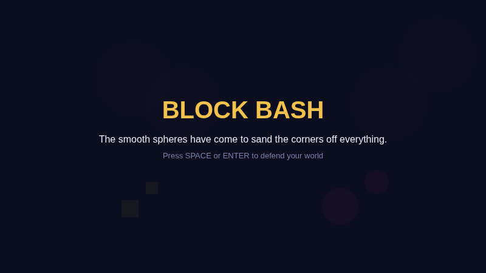
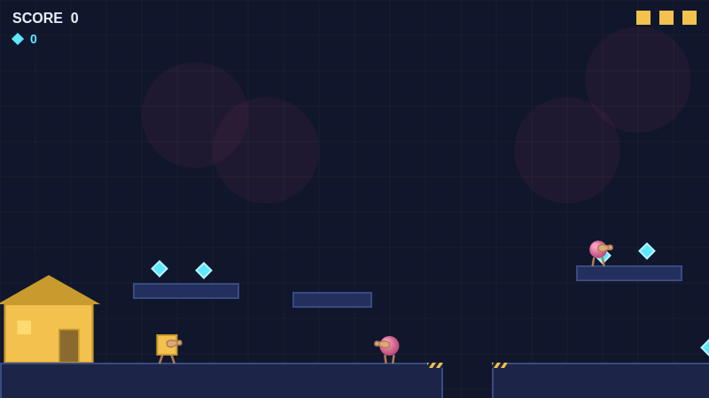
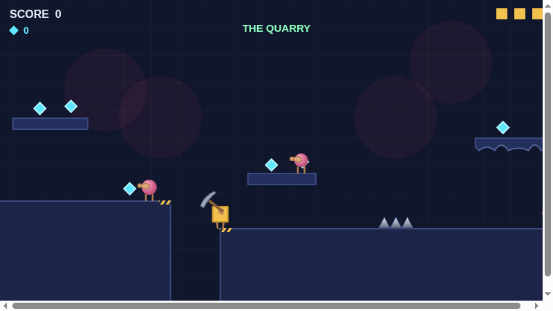
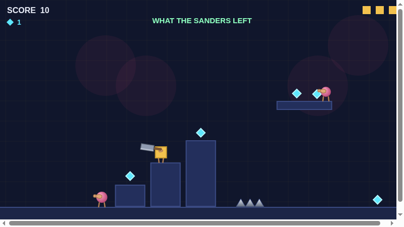
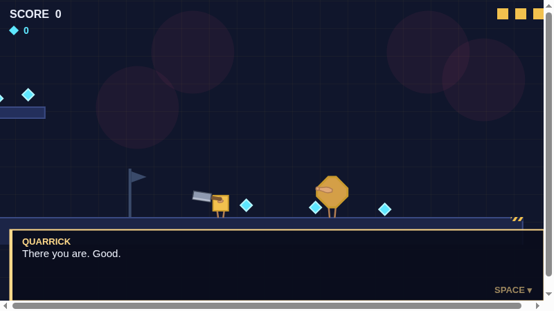
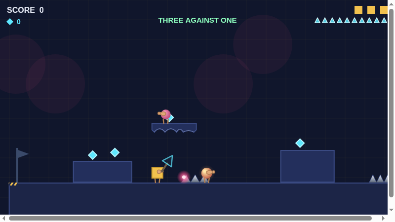
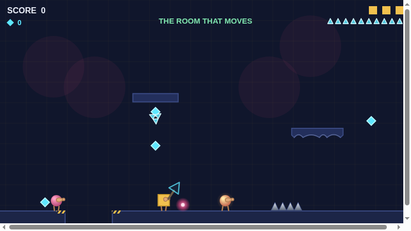
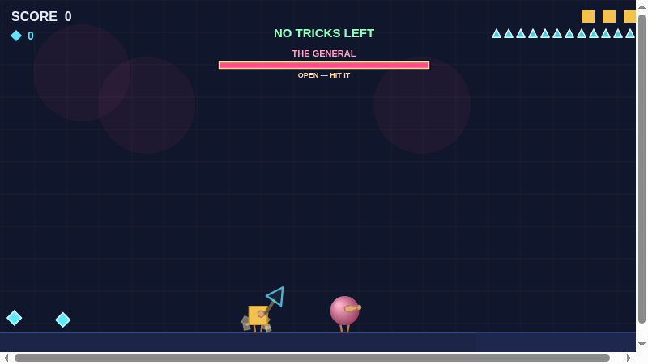
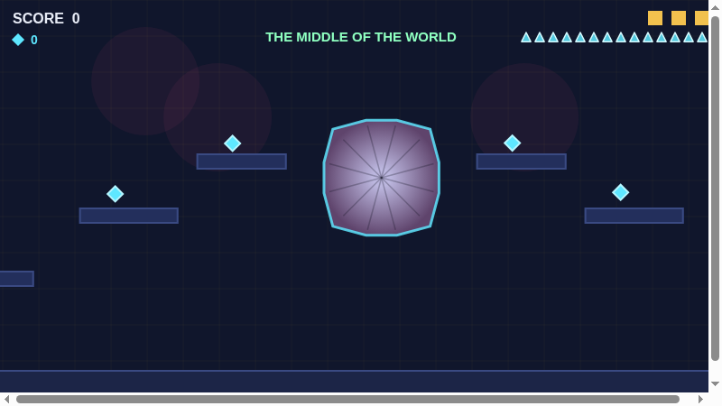

# Block Bash

**The smooth spheres have come to sand the corners off everything.**



A 2D platformer about a world made of blocks and the round things that are
grinding it down. You're a square. Your planet is a cube. The spheres that
landed on it don't destroy what they touch so much as *smooth* it — corners
cut to angles, angles worn to curves, until nothing is square any more.

Everything is drawn with canvas shapes and every sound is synthesized on the
fly. No sprites, no audio files, no art pipeline — the look is a consequence
of how it's built, not a style applied on top.

Built in the evenings by a dad and his son. It's playable end to end now —
still rough in places, and still moving.

---

## Screenshots

Level 1 — you start at your own front door, and it goes downhill from there.



Every face of the cube is a different shape of place, not just a different
set of enemies. **The Quarry** is cut in terraces and you climb down into it.



**What the Sanders Left** was ground into columns. You go up.



Halfway through it, Quarrick gives you the Cornerstone. He has been losing
corners since you met him and nobody has mentioned it.



**Three Against One** is about sightlines. The spheres shoot now — the hot
orange ones — and their shots stop at anything solid, so the low blocks are
worth standing behind.



**The Room That Moves** doesn't stay where you left it.



Bosses tell you what they're doing. The bar says whether it can be hurt right
now; red empties, cyan fills.



And at the middle of the world, a cube with every corner shaved off it —
part of the way back to being square.



---

## Play it

No build step, no npm, no dependencies. It does need to be served over
`http://` rather than opened as a `file://` — the game is split into ES
modules, and browsers won't load modules off the filesystem.

Any static server works. With Python:

```bash
git clone https://github.com/mk-z3r0/BlockBash.git
cd BlockBash
python3 -m http.server 8000
```

Then open <http://localhost:8000/>.

If you use VS Code, the **Live Server** extension does the same thing —
right-click `index.html` → *Open with Live Server*.

### Controls

| Action | Keyboard | Xbox / standard gamepad |
|---|---|---|
| Move | `←` `→` or `A` `D` | D-pad or left stick |
| Jump | `Space`, `↑`, or `W` | **B** (right button) |
| Run | hold `Shift` | hold **A** (bottom button) |
| Swing your weapon | `B` | **Y** |
| Pause | `Esc` | **Start** |
| Mute | `M` | — |

Jump height depends on how long you hold the button, and how fast you were
moving when you left the ground. Running isn't just faster — several gaps in
level 1 can't be crossed without it.

The weapon button does nothing until you've earned a weapon. You start with
nothing, and what the button does changes with what you're holding — a short
chop, a heavy overhead swing, or a fired triangle. From level 3 on, the
triangles are counted: the pips at the top right are all you have, and putting
a corrupted square back costs two of them.

You carry **one weapon at a time**. There's a sledgehammer lying on a shelf
in level 6, and picking it up means putting the Cornerstone down.

Jumping on a sphere always works, and never runs out.

A gamepad is picked up automatically once you press a button on it; there's
nothing to configure.

### Starting somewhere other than the beginning

Once you've reached a face, you can start from it. The title screen shows a
**level picker** — `←` and `→` to choose, `SPACE` to go — listing every level
you've got to. It's the `Best: level N` line on that screen made useful.

For poking at one thing without playing to it:

| | |
|---|---|
| `?level=2` | boot straight into level 2, skipping the title entirely |
| `?debug` | unlock every level in the picker, and turn on the traversal keys below |
| `?test` | load the sandbox copy of level 1 instead of the real game |

With `?debug` running, in-game:

| Key | Does |
|---|---|
| `]` / `[` | warp to the next / previous checkpoint in this level |
| `N` / `P` | jump to the next / previous level |

Those keys are behind the flag on purpose — they're exactly what a child
leaning on the keyboard would use to skip the game by accident.

### What's playable right now

**All seven levels, start to finish.** Six faces of a cube planet, then a
descent, then the hollow centre and whatever the spheres have been digging
toward. Seven bosses, none of which is a bigger version of the last one, and
an ending that isn't a kill.

Each face has its own shape — one is terraced, one is columns you climb, one
is cover and sightlines, one won't hold still, one is four arenas and a
fight. Enemies escalate from patrolling, to carrying tools and chasing you,
to shooting, to chainsaws.

There's an opening cutscene the first time you play — skippable, and it only
ever plays once. From level 2 onward the characters talk; `Space` advances a
line and `Esc` skips a scene.

Each level has three checkpoints, and dying puts you back at the last one
rather than at the start of the game.

Progress is saved to your browser's local storage. Clearing site data resets
it.

**A fair warning about difficulty.** Every level is machine-checked for being
*possible* — a probe tries every jump in the game at both speeds and won't let
a level ship if something can't be cleared. That is not the same as being
well-paced. Levels 4 to 6 in particular have never been played by an actual
person, and if they turn out to be too hard, they're too hard. Notes on that
are the most useful thing anyone could send.

---

## Repo layout

| Path | What's in it |
|---|---|
| `index.html` | the page the game runs in |
| `src/` | all game code, plain ES modules (`engine/`, `entities/`, `levels/`, `scenes/`, `weapons/`, `cutscenes/`, `ui/`, `audio/`) |
| `tools/` | dev-only pages. `bash tools/run-probes.sh` runs the test suite; `tools/level-editor.html` is a visual editor for the levels; `tools/physics-lab.html` is a live movement-tuning rig |
| `GAME_DESIGN.md` | what the game is: story, mechanics, open questions |
| `IMPLEMENTATION_PLAN.md` | how it gets built, in what order, and why each decision went the way it did |

Both documents are kept current and are the honest record — including the
parts that are still undecided.

---

## Contributions

**Not open to pull requests yet.** The design is still moving week to week,
and a lot of what looks like a bug right now is a decision that hasn't been
written down yet. Taking outside changes at this stage would cost more to
review than it would gain.

The code is public because it's more useful to read than to hide. Read it,
run it, learn from it, fork it for yourself. Bug reports and "this felt bad
to play" notes are genuinely welcome as issues — that kind of feedback is
worth a lot more to this project right now than patches.

This will open up as it gets closer to finished.
