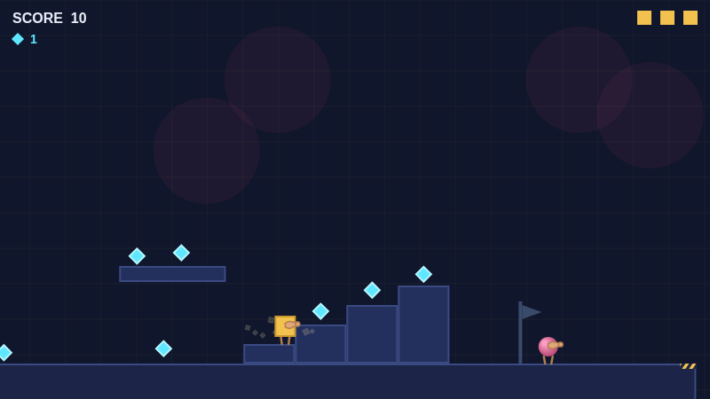
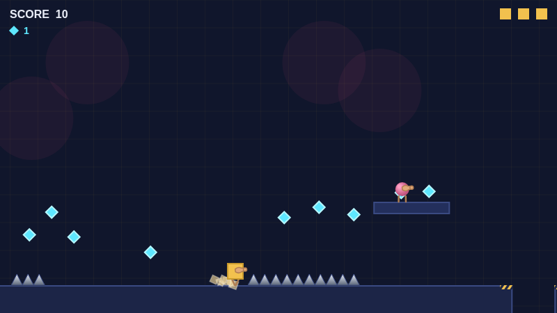

# Block Bash

**The smooth spheres have come to sand the corners off everything.**


A 2D platformer about a world made of blocks and the round things that are
grinding it down. You're a square. Your planet is a cube. The spheres that
landed on it don't destroy what they touch so much as *smooth* it — corners
cut to angles, angles worn to curves, until nothing is square any more.

Everything is drawn with canvas shapes and every sound is synthesized on the
fly. No sprites, no audio files, no art pipeline — the look is a consequence
of how it's built, not a style applied on top.

This is a work in progress, built in the evenings by a dad and his son.

---

## Screenshots

Level 1 — you start at your own front door, and it goes downhill from there.


Coins mark the line a good jump takes. Follow the arc and you'll usually
land somewhere sensible.



The second half asks for more precision. The debris the spheres leave behind
is not decorative.



---

## Play it

No build step, no npm, no dependencies. It does need to be served over
`http://` rather than opened as a `file://` — the game is split into ES
modules, and browsers won't load modules off the filesystem.

Any static server works. With Python:

```bash
git clone https://github.com/mk-z3r0/BlockBash.git
cd BlockBash
python3 -m http.server 8000
```

Then open <http://localhost:8000/>.

If you use VS Code, the **Live Server** extension does the same thing —
right-click `index.html` → *Open with Live Server*.

### Controls

| Action | Keyboard | Xbox / standard gamepad |
|---|---|---|
| Move | `←` `→` or `A` `D` | D-pad or left stick |
| Jump | `Space`, `↑`, or `W` | **B** (right button) |
| Run | hold `Shift` | hold **A** (bottom button) |
| Swing your weapon | `B` | **Y** |
| Pause | `Esc` | **Start** |
| Mute | `M` | — |

Jump height depends on how long you hold the button, and how fast you were
moving when you left the ground. Running isn't just faster — several gaps in
level 1 can't be crossed without it.

The weapon button does nothing until you've earned a weapon. You start with
nothing.

A gamepad is picked up automatically once you press a button on it; there's
nothing to configure.

### What's playable right now

Level 1, start to finish, with three checkpoints. There's an opening cutscene
the first time you play — it's skippable, and it only ever plays once.
Everything past level 1 is still being built.

Progress is saved to your browser's local storage. Clearing site data resets
it.

---

## Repo layout

| Path | What's in it |
|---|---|
| `index.html` | the page the game runs in |
| `src/` | all game code, plain ES modules (`engine/`, `entities/`, `levels/`, `scenes/`, `weapons/`, `ui/`, `audio/`) |
| `tools/` | dev-only probe pages — single-purpose test harnesses, each answering one question. `tools/physics-lab.html` is a live movement-tuning rig |
| `GAME_DESIGN.md` | what the game is: story, mechanics, open questions |
| `IMPLEMENTATION_PLAN.md` | how it gets built, in what order, and why each decision went the way it did |

Both documents are kept current and are the honest record — including the
parts that are still undecided.

---

## Contributions

**Not open to pull requests yet.** The design is still moving week to week,
and a lot of what looks like a bug right now is a decision that hasn't been
written down yet. Taking outside changes at this stage would cost more to
review than it would gain.

The code is public because it's more useful to read than to hide. Read it,
run it, learn from it, fork it for yourself. Bug reports and "this felt bad
to play" notes are genuinely welcome as issues — that kind of feedback is
worth a lot more to this project right now than patches.

This will open up as it gets closer to finished.
